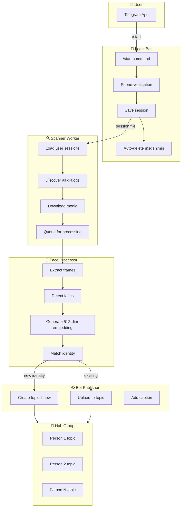

# 🎯 Telegram Face Recognition System

Automatically archive and organize Telegram media by detected faces. The system scans your chats, identifies faces in photos/videos, and organizes them into dedicated topic threads.

---

## 📋 Table of Contents

1. [Prerequisites](#-prerequisites)
2. [Step-by-Step Setup](#-step-by-step-setup)
3. [Adding Your Accounts](#-adding-your-accounts)
4. [Dashboard](#-dashboard)
5. [Troubleshooting](#-troubleshooting)
6. [How It Works](#-how-it-works)

---

## ✅ Prerequisites

Before starting, you need:

| Requirement | How to Get It |
|-------------|---------------|
| **Docker Desktop** | Download from [docker.com](https://www.docker.com/products/docker-desktop/) |
| **Telegram API Credentials** | Get from [my.telegram.org](https://my.telegram.org) (see Step 2) |
| **A Telegram Bot** | Create via [@BotFather](https://t.me/botfather) (see Step 3) |
| **A Telegram Group with Topics** | Create one in Telegram app (see Step 4) |

> [!NOTE]
> **You only need ONE set of API credentials** - they identify your *application*, not each user. All user accounts share the same api_id/api_hash.

---

## 🚀 Step-by-Step Setup

### Step 1: Download the Project

```bash
git clone https://github.com/bryanseah234/telegramcollector.git
cd telegramcollector
```

---

### Step 2: Get Telegram API Credentials (One-time)

These credentials identify your **application** to Telegram. You only need one set for all users.

1. Go to **<https://my.telegram.org>**
2. Log in with **any phone number**
3. Click **"API development tools"**
4. Create an application (any name)
5. **Copy**:
   - `api_id` (number like `12345678`)
   - `api_hash` (string like `abcd1234...`)

---

### Step 3: Create Your Bot

The bot handles login registration and publishes media to the hub group.

1. Open Telegram, search for **@BotFather**
2. Send `/newbot`
3. Follow prompts (name must end in `bot`)
4. **Copy the bot token** (like `123456:ABC...`)

**Important**: Add this bot as **admin** to your Hub Group later!

---

### Step 4: Create Your Hub Group

This is where the system creates topic threads for each identified person.

1. Create a **new Telegram group**
2. Go to **Group Settings** → Enable **Topics**
3. **Add your bot as admin** (the one from Step 3)
4. Get the **Group ID**:
   - Forward any message to **@userinfobot**
   - Copy the ID (like `-1001234567890`)

---

### Step 5: Configure Environment

```bash
cp .env.template .env
```

Edit `.env`:

```env
# From Step 2 (one-time, shared by all)
TG_API_ID=12345678
TG_API_HASH=your_api_hash

# From Step 3
BOT_TOKEN=123456:ABC...

# From Step 4
HUB_GROUP_ID=-1001234567890

# Set a secure password
DB_PASSWORD=MySecurePassword123!

# Optional: Custom Container Names
# COMPOSE_PROJECT_NAME=my_custom_name
```

---

### Step 6: Start the System

```bash
docker-compose up -d --build
```

Wait 2-3 minutes, then check:

```bash
docker-compose ps
```

All services should show "Up":

- `face_archiver_db` - Database
- `face_archiver_app` - Scanner worker
- `face_archiver_login_bot` - Registration bot
- `face_archiver_dashboard` - Web interface

---

## 👤 Adding Your Accounts

Users register their accounts by messaging the bot.

### Registration Flow

1. Find your bot in Telegram (created in Step 3)
2. Send `/start`
3. Send your **phone number** (e.g., `+1234567890`)
4. Telegram sends you a **verification code** → send it to the bot
5. If 2FA enabled, send your **password** (deleted immediately)
6. ✅ Done! Your account is registered

**All messages are auto-deleted after 2 minutes for security.**

The system will automatically scan **ALL chats** accessible from registered accounts.

---

## 📊 Dashboard

Open **<http://localhost:8501>** in your browser.

| Section | What You Can Do |
|---------|-----------------|
| **Dashboard** | View statistics, activity charts, health status |
| **Identity Gallery** | Browse all identified people, search, sort |
| **Identity Detail** | Rename people, merge duplicate identities |
| **Face Search** | Upload a photo to find matching identities |

---

## ❓ Troubleshooting

### Bot not responding

```bash
docker-compose logs login_bot
```

Check if BOT_TOKEN is correct.

### Dashboard not loading

Port 8501 might be in use. Check with `docker-compose ps`.

### View all logs

```bash
docker-compose logs -f
```

---

## 🔧 How It Works

### System Flow



### Database Schema

| Table | Key Columns | Purpose |
|-------|-------------|---------|
| `telegram_accounts` | phone_number, session_file_path, status | Registered user sessions |
| `telegram_topics` | topic_id, label, face_count, message_count | Identity topics in hub |
| `face_embeddings` | embedding (512-dim vector), topic_id, quality_score | Facial embeddings for matching |
| `scan_checkpoints` | chat_id, last_processed_message_id, scan_mode | Resume scanning from last point |
| `uploaded_media` | source_chat_id, source_message_id, hub_message_id | Prevent duplicate uploads |
| `processed_media` | file_unique_id, faces_found | Dedupe forwarded media |
| `excluded_chats` | chat_id, account_id | Opt-out specific chats |
| `processed_users` | user_id, photo_id | Track profile photo scans |
| `health_checks` | database_ok, telegram_ok, queue_size | System health monitoring |

---

## 🔒 Security Notes

- **Never share `.env`** - contains credentials
- **Bot auto-deletes all messages** after 2 minutes
- **2FA passwords deleted immediately**
- **Session files are login tokens** - keep secure
- **Database contains biometric data** - protect it

---

## 📁 Project Files

```
telegramcollector/
├── .env                # Config (NEVER share!)
├── docker-compose.yml  # Docker services
├── init-db.sql         # Database schema
├── login_bot.py        # Registration bot
├── bot_client.py       # Bot singleton for publishing
├── worker.py           # Main scanner
├── topic_manager.py    # Topic creation (uses bot)
├── media_uploader.py   # Media publishing (uses bot)
├── face_processor.py   # InsightFace AI detection
├── identity_matcher.py # pgvector similarity search
├── dashboard.py        # Web interface
└── sessions/           # Saved login sessions
```

---

**Need help?** Open an issue on GitHub!
